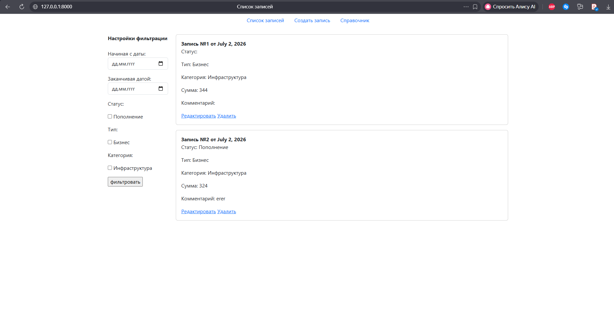
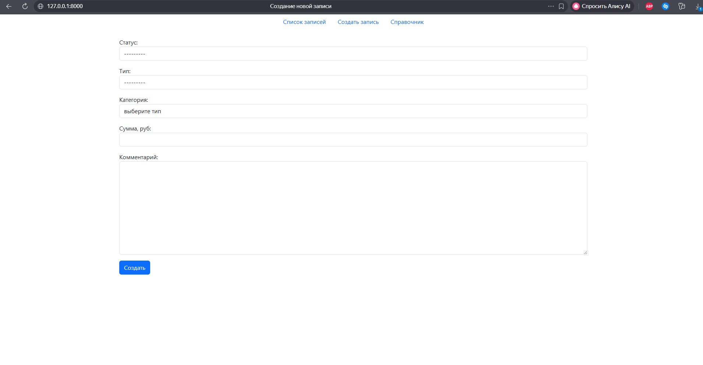
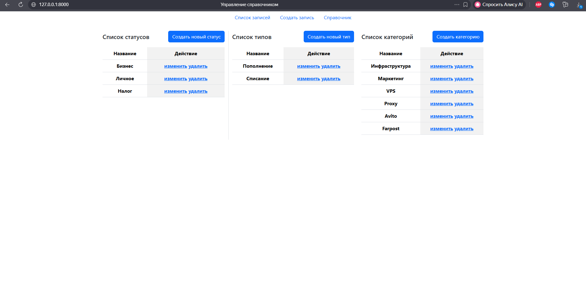
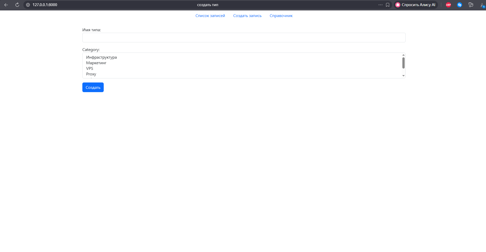
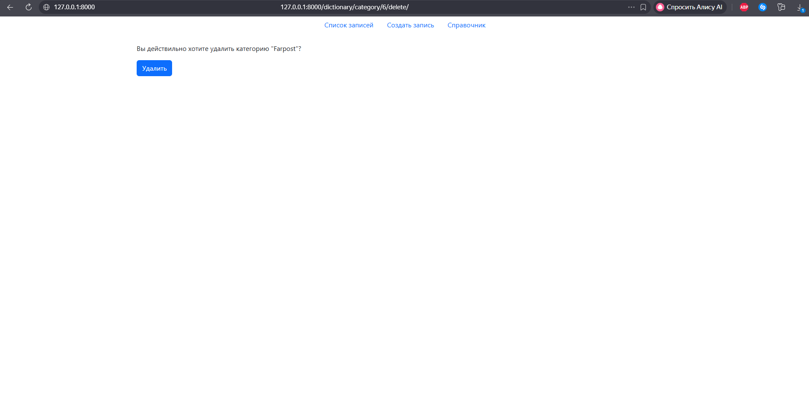

# Тестовое задание 

## О проекте
Репозиторий для выполенния [тестового задания](docs/Python-%D1%80%D0%B0%D0%B7%D1%80%D0%B0%D0%B1%D0%BE%D1%82%D1%87%D0%B8%D0%BA%20_%20Data%20%26%20Automation%20Developer%20%28%D0%A2%D0%B5%D1%81%D1%82%D0%BE%D0%B2%D0%BE%D0%B5%29.docx)

Веб-интерфейс реализован с помощью djnago + django-templates. Для оформления стилей
используется интерфейсный инструментарий Bootstrap.

Для маршрутизации по сайту
представлена навигационная панель из 3-х вкладок (сверху):
- Список записей
- Создать запись
- Справочник

Вкладка список записей выводит карточки с записями ДДС с полной информацией о них. Справа от 
списка находится панель фильтрации. Фильтрации доступна по дате начала, дате конца и 
диапазону в пределах двух дат. Так же фильтрация осуществляется статусам, категориям и типам.
Для выбора параметров фильтрации используются чекбоксы.



Вкладка создать запись отображает форму для ввода данных. При выборе типа записи
с сервера динамически подтягиваются соответствующие категории. Валидация 
осуществляется со стороны клиента и сервера.



Вкладка справочник выводит информацию по существующим сущностям объектов статус, 
тип и категорий.



Вверху таблиц, напротив оглавления находятся кнопки для создания 
новых сущностей. Для каждого соответствующего объекта в колонке действие доступы 
действия по редактированию и удалению сущности. При нажатии по кнопке редактировать 
открывается форма аналогичная форме создания соответвующей сущности.



При удалении любой сущности пользователю необходимо подтвердить действие



## Структура проекта
- core - папка проекта Django
- dds - приложения для управления проведения ДДС записей
- dictionary - приложения для управления справочниками (статусы, типы, категории)
- api - API для выдачи данных по категориям для выбранных типов
- static/update-data.js - скрипт для динамического обновления контента 
выпадающего списка категорий, в зависимости от выбранного типа
- templates - директория с HTML-шаблонами страниц приложений

## Необходимые компоненты
- Python 3.14
- Зависимости из requiremets.txt


## Запуск
1. Клонирование репозитория 
```commandline
git clone https://github.com/TwentyOn/test_tasks.git -b first_it_task
```
2. Создать виртуальное окружение
```commandline
python -m venv .venv
```
3. Активировать окружение
- windows (CMD)
    ```commandline
    venv\Scripts\activate
    ```
- macOS / Linux:
    ```commandline
    source venv/bin/activate
    ```

4. Установка зависимостей
```commandline
pip install -r requiremets.txt 
```
5. Применить миграции Django
```commandline
python manage.py migrate
```
6. Запуск dev-сервера
```commandline
python manage.py runserver
```
